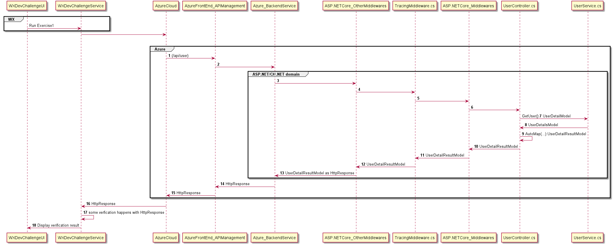
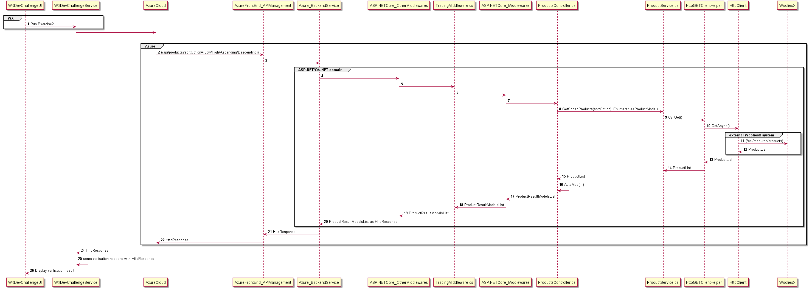
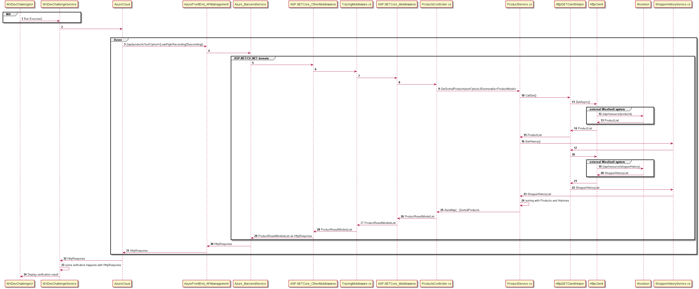
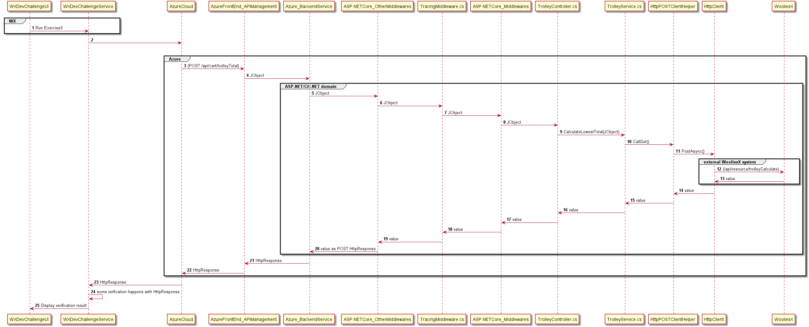

## README

### Running the code.
* After you checkout out the source code from the `develop` branch, go to `WooliesXTechChallengeApi` folder in the repository to open the solution in Visual Studio 2022. 
* Since the the Challenge consist to one project you can also build via commandline if you have dotnet command install. Following is the command to execute.
 `dotnet clean;dotnet build;dotnet run --project ".\WooliesXTechChallengeApi\WooliesXTechChallengeApi\"`. 
 The other project is UnitTest Project.

* Alternatively, you can open the solution in Visual Studio 2022 and build run.
* Upon running the WebApp via VS 2022, SwaggerUI should be open up for you.

* Similarly, There are tested added to cover codebase where logics are.
* All Services and HttpXXXClientHelpers are covered with unit tests.


### How to use the App
* You can use Swagger UI while the WebApp is running.
* Alternatively, the WEB App is running in Azure with following base url `https://wooliesxtechchallengeapi20210430235415.azurewebsites.net/api`

I used the following urls to test with WooliesX.

Exercise 1: https://wooliesxtechchallengeapi20210430235415.azurewebsites.net/api

Exercise 2: https://wooliesxtechchallengeapi20210430235415.azurewebsites.net/api/products?sortOption=Low

Exercise 3: https://wooliesxtechchallengeapi20210430235415.azurewebsites.net/api/cart

Token: 07a1fed8-57de-410c-b2de-ecc425dd1fb5


NOTE: Fine grand details about the code and and design can be found documented below.
Experience, ideas and thought processes can be found described per Exercise in the Summary Pointers.  

# Summary Pointers:
### Running the test with wooliesX api

NOTE: THe bold number labels found on the Sequences Diagrams are steps takens is passing or retrieving data.
## Exercise 1:
To test and verify Exercise 1, following is the request passed in the swaggerUI:


```
{
  "token": "07a1fed8-57de-410c-b2de-ecc425dd1fb5
",
  "url": "https://wooliesxtechchallengeapi20210430235415.azurewebsites.net/api"
}
```
Following is the Sequence Diagram that illustrates the flow of information between WoolieX environment and my Azure Environment.

* Taking reference from label reference *5*, the is the first point of the application where the request is reached and the TracingMiddleware.cs will log the path of the reqeust
* The Http context is passed to the next middlewares. 
* After the request has passed serveral middlesware in between TracingMiddleware.cs and UserController.cs, the route (/api/user) is matched to the routing specified on the UserController and with the GET request call is matched to the method `GetUser()`. The `GetUser()` method, labeled `7` in bold, will use the UserService.cs to retrieve the default user information in UserDetailsModel. 
* UserDetailModel is used in the Service Layer and will not know other Model outside Service Layer. 
* It is the responsibility of the Controller to convert the model to UserDetailsResultModel. 
* UserDetailsResultModel is for the purpose of use in the controller layer.
* The UserDetailModel is converted to UserDetailResultModel to be send as a HttpResponse. 
* This a brief breakdown of the process happening between label 7 and 9. As specified in label `9`, AutoMapper is a library used to map between Data Models. It helps to do some heavylifting on converting the models.

This maintaining this seperation would help the service layer to extracted out as a seperate library and the service layer do not need to know anything about the Controller layer. 

* The focus of the Controller layer would be to focus on the http requests and responses processing and channeling the information to the correct services based on a single service associated with a single api route. 
* I kept this seperation strict to later implement Command-Query Responsibility Segregation(CQRS) and this would also aid in moulding the data to the required model for ,instance, frontend or for the other external system.


## Exercise 2. 
To test and verify Exercise 2, following is the requested in passed in the swagger:


               

```
{
  "token": "07a1fed8-57de-410c-b2de-ecc425dd1fb5",
  "url": "https://wooliesxtechchallengeapi20210430235415.azurewebsites.net/api/products?sortOption=Low"
}
```

Following is the Sequence Diagram for Low, High, Ascending and Descending sortedOption states.


* The above sequence diagram focus on GET call and the ProductService has the responsibility to query a different system to retrieve product list as labeled `9` in bold. 
* ProductService won't know and will not have the responsibility to know when remote api to call or which system to call to retrieve the product. * ProductService's responsibility is to retrieve the product list and sort them based on the parameter value. 
* The source of data can be from a relational or nosql database or from a network. 
* The source and the awareness of how to retrieve this information is irrelavant to the  Service. Having stated this, it becomes clear of where and to which layer future responsibilities lies in. 
* The HttpGETClientHelper helps to setup the base address and path to make a GET call. There can be various where of making a GET call and different remote systems have different protocols to retrieve same type of information, in this case Products. 
* HttpGETClientHelper sets up to retrieve all products. This is not pragmatic. 
* some systems, have pagination over querying all information. Systems if Amazon requires to make a POST call with xml payload to retrieve products. Hence, the seperate made as HTTPGETClientHelper and itsa future associates are focused on getting out entity. 

* The CallGet() method in HttpGETClientHelper is a generic method. I decided to take this approach to reuse code for other services that requires to make GET call to retrieve data. 
* If we are to extend the GET call to be supported in different shapes and forms, like in Amazon, eBay or MYOB platforms, we can analysis those apis and look to extend functionalities around those platforms' styles, in a generic sense. AppSetting.json can be used to identify the style of GET call we prepare to make for specific platforms. Then eventually we can implement Factory Method pattern. 
* Alternatively, when there is demand to support GET/POST/PUT of various kinds, then Abstract Factory Pattern can be used to builkd HttpClientHelper with that support.

Following is the unique case for Recommended sortedOption status. Below is the sequence diagram.


* For this SortOption state, it requires to make two calls. 
* Have to call the products api to retrieve all the products and order them in them model. The ShopperHistory api call, labeled `19` in bold, has to be called to retrieve the history to identify the popular products in order. There are possibilies of not all products are listed in the history. So I retrieved all the products for the all the history line items and group them by their name and record their quantity. Based on this sumed quantity, I can sort products by their quantity in descending order. I also made sure that since it is not necessary that all products are listed in the history, then I have to identify the products which are not in the history and append them to the sorted list. The ordering, sorting and extracting products are done in the ProductService. I also used Linq syntax because the language provide processing the data quickly and the compiler does a better job optimising LINQ than myself. I gave the responsibility of compiling to efficient code than me trying to code nested for loops. 
## Exercise 3
To test and verify Exercise 3, following is the requested in passed in the swagger:


```
{
    "token": "07a1fed8-57de-410c-b2de-ecc425dd1fb5",
    "url": "https://wooliesxtechchallengeapi20210430235415.azurewebsites.net/api/cart"
}
```

Following is the sequence diagram for POST call.


The role of the controller has changed for TrolleyController. Since, there is no documented information of it's data model or structure. I tried with an asumption of what happen of I were to take that exact model and pass it on the destination system. With tthis simple test, I learned that the data strand does not need to have a data model and the data is generic. None of the layers are aware of the meaning of the data. The layers are simply passing JObject from source to destination system. Nevertheless, my challenge is the app initially wasn't able to receive the JObject payload. So me diagnosis begin implementing a middleware to detect whether do the app at least get hit with its base address, to begin with and work my way into TrolleyController receiving the JObject payload.

#### Odd Behaviour:

I've noticed that this website is not working at the moment,
https://dev-wooliesx-recruitment.azurewebsites.net/exercise

Noticed that the website is not sending the token to the backend. Following is the screenshot.


#### Source Code:
* I used GitFlow pattern to branching out of master and working on develop branch

#### Resource folder
* the resources folder have the postman collection which is used to test the apis in Azure for this hosted app.

#### Design Info / Implementation Pattern
* At high level, 2-tier arachitecture pattern is followed.(Controller/Services)
* the Services Layer will use the DataModel.
* the Controller Layer will use the ResultModels as a response payload.
* I used AutoMapper to map and transform the data from DataModels to ResultModels. This is a cleaner way to seperate between Controller and Service layer.
* The Interface folder consist of all the interfaces and the Implementation folder consists of all the implementations of the Interfaces
* There is a next deep lower level after Service Layer that's in change of external api calls to wooliesX apis.
    * HttpPOSTClientHelper focus on making POST calls
    * HttpGETClientHelper focus on making GET calls.
    * I placed these Helpers in the Helpers folders 
* I had to add a Middleware to have a tracing to capture and log the requests before passing the request up the Controllers.
    * This was needed to log and diagnose on the POST call for the /trolleyCalculate
    * Eventually it became helpful to monitor other requests as well.

### Thought Process to the Challenge.
* I have to spend considerable amount of time to section the challenge into three parts.
    * App Deployment in Azure
    * the Development
    * Unit  and Manual Testing

* I spend considerable amount of time developing and testing iteratively.
* As I develop the easiest Exercise 1, I started to in coporate Azure deployment to test in that environment.
* There were some challenges and quick learnings on Azure to set the environment up and capture logings 
* Then moving on to Exercise 2 and fell into a small trick of missing the last product which not found in the Shopper's History.
    * this took some time to test and figure out.
* Moving on to Exercise 3, it became tricky to test with POST call. However with trial and errors, I figured out to capture the request and verify that
the controller is able to capture the payload on the POST call. I decided to not make an model for the POST call payload. I tried passing the payload and JObject and 
traverse this jobject all the way to WooliesX's TrolleyCalculater api.

* Most time is also spend on polishing the code and added unit tests at the same time. Since, I started adding unit test for Helpers classes and then to the Service classes, I wasn't able to cover unit tests for the controller layer.

* I decided to use IHttpClientFactory instead of `new HttpClient()` directly due to disposing issue after use.
* I decided to use Generic Method for the Helper classes to safe from repeated code.
* AppSettings.json is used to specify constant values to avoid any hard coding in classes. 


## Overall:
I find the challenge very interesting and definitely intrigues me and I learned and felt grown just a tiny bit.
I  am happy that I was able to implement some new features of the C# language.
## Areas I would like to improve on if I revisit this challenge.
* Continue to play and explore with Azure Cloud.
* Dig deeper into learning other nuget packages that can help to implement with less code and deliever more value.
* Investigate into mocking some of the .NET classes like HttpClient and alternative methods to mocking static extension methods
* Improve on Swagger documentation on the Apis.
* Finish of the unit tests for controller layer.
* Not able to setup swagger in Azure cloud, so would be nice to know why and find a workaround. (Note: Swagger in working locally)

## References:
* https://dev-wooliesx-recruitment.azurewebsites.net/?token=07a1fed8-57de-410c-b2de-ecc425dd1fb5


