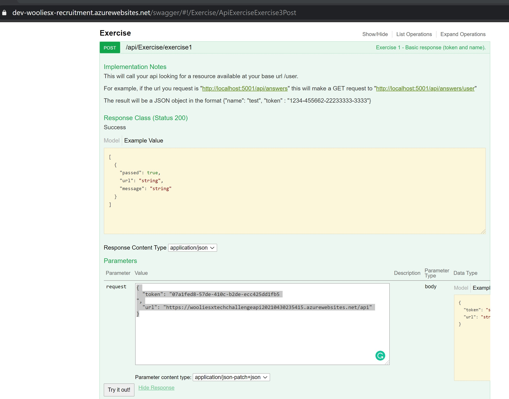
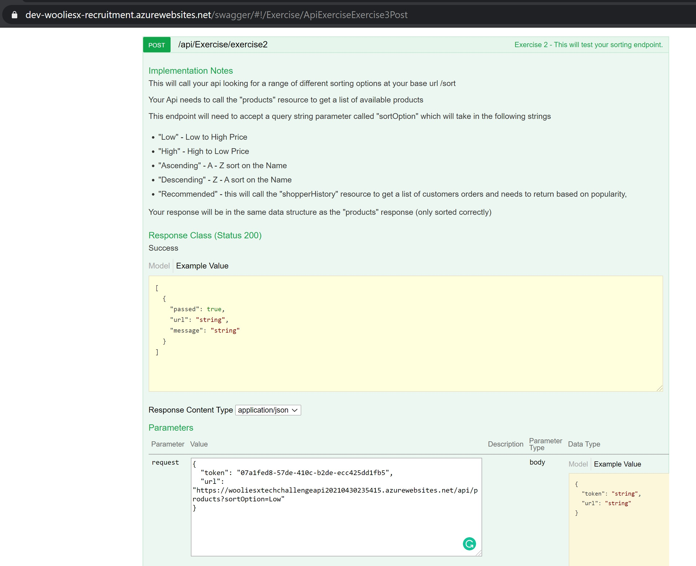
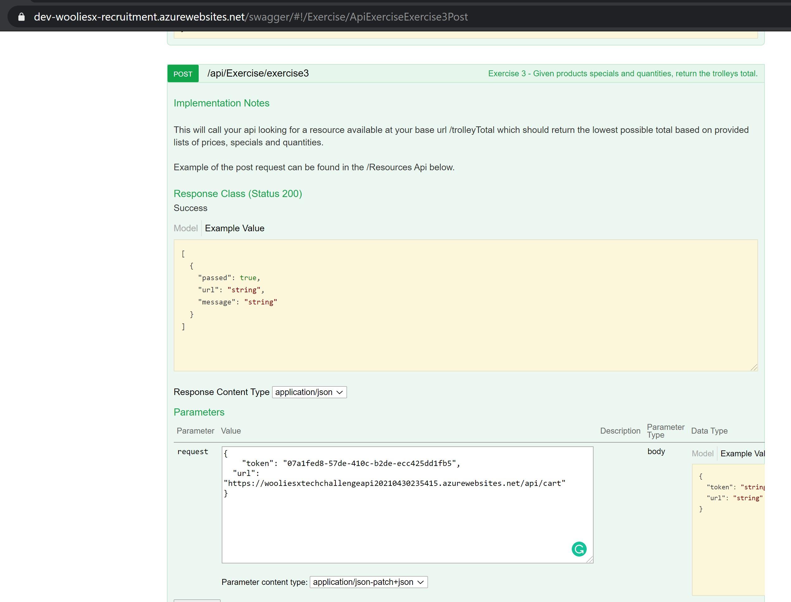
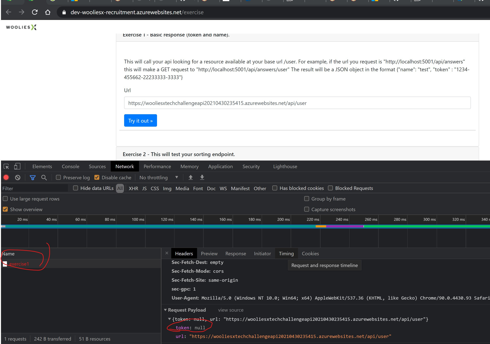

## README

### Summary Pointers:


### Running the test with wooliesx api

## Exercise 1:
To test and verify Exercise 1, following is the requested in passed in the swagger:


```
{
  "token": "07a1fed8-57de-410c-b2de-ecc425dd1fb5
",
  "url": "https://wooliesxtechchallengeapi20210430235415.azurewebsites.net/api"
}
```

## Exercise 2:
To test and verify Exercise 2, following is the requested in passed in the swagger:


```
{
  "token": "07a1fed8-57de-410c-b2de-ecc425dd1fb5",
  "url": "https://wooliesxtechchallengeapi20210430235415.azurewebsites.net/api/products?sortOption=Low"
}
```

## Exercise 3:
To test and verify Exercise 3, following is the requested in passed in the swagger:


```
{
    "token": "07a1fed8-57de-410c-b2de-ecc425dd1fb5",
    "url": "https://wooliesxtechchallengeapi20210430235415.azurewebsites.net/api/cart"
}
```

#### Odd Behaviour:

I've noticed that this website is not working at the moment,
https://dev-wooliesx-recruitment.azurewebsites.net/exercise

Noticed that the website is not sending the token to the backend. Following is the screenshot.



#### Source Code:
* I used GitFlow pattern to branching out of master and working on develop branch

#### Running the code.
* Since the the Challenge consist to one project `dotnet clean;dotnet build;dotnet run --project ""`

#### Resource folder
* the resources folder have the postman collection which is used to test the apis in Azure for this hosted app.

#### Design Info / Implementation Pattern
* At high level, 2-tier arachitecture pattern is followed.(Controller/Services)
* the Services Layer will use the DataModel.
* the Controller Layer will use the ResultModels as a response payload.
* I used AutoMapper to map and transform the data from DataModels to ResultModels. This is a cleaner way to seperate between Controller and Service layer.
* The Interface folder consist of all the interfaces and the Implementation folder consists of all the implementations of the Interfaces
* There is a next deep lower level after Service Layer that's in change of external api calls to wooliesX apis.
    * HttpPOSTClientHelper focus on making POST calls
    * HttpGETClientHelper focus on making GET calls.
    * I placed these Helpers in the Helpers folders 
* I had to add a Middleware to have a tracing to capture and log the requests before passing the request up the Controllers.
    * This was needed to log and diagnose on the POST call for the /trolleyCalculate
    * Eventually it became helpful to monitor other requests as well.

### Thought Process to the Challenge.
* I have to spend considerable amount of time to section the challenge into three parts.
    * App Deployment in Azure
    * the Development
    * Unit  and Manual Testing

* I spend considerable amount of time developing and testing iteratively.
* As I develop the easiest Exercise 1, I started to in coporate Azure deployment to test in that environment.
* There were some challenges and quick learnings on Azure to set the environment up and capture logings 
* Then moving on to Exercise 2 and fell into a small trick of missing the last product which not found in the Shopper's History.
    * this took some time to test and figure out.
* Moving on to Exercise 3, it became tricky to test with POST call. However with trial and errors, I figured out to capture the request and verify that
the controller is able to capture the payload on the POST call. I decided to not make an model for the POST call payload. I tried passing the payload and JObject and 
traverse this jobject all the way to WooliesX's TrolleyCalculater api.

* Most time is also spend on polishing the code and added unit tests at the same time. Since, I started adding unit test for Helpers classes and then to the Service classes, I wasn't able to cover unit tests for the controller layer.

* I decided to use IHttpClientFactory instead of `new HttpClient()` directly due to disposing issue after use.
* I decided to use Generic Method for the Helper classes to safe from repeated code.
* AppSettings.json is used to specify constant values to avoid any hard coding in classes. 


## Overall:
I find the challenge very interesting and definitely intrigues me and I learned and felt grown just a tiny bit.
I  am happy that I was able to implement some new features of the C# language.
## Areas I would like to improve on if I revisit this challenge.
* Continue to play and explore with Azure Cloud.
* Dig deeper into learning other nuget packages that can help to implement with less code and deliever more value.
* Investigate into mocking some of the .NET classes like HttpClient and alternative methods to mocking static extension methods
* Improve on Swagger documentation on the Apis.
* Finish of the unit tests for controller layer.
* Not able to setup swagger in Azure cloud, so would be nice to know why and find a workaround. (Note: Swagger in working locally)


